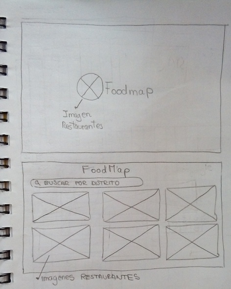

#  F O O D M A P

## INTRODUCCIÓN
FoodMap es una aplicación que permite al usuario buscar restaurantes cerca o alrededores,ademas te permite ver los datos relevantes 
de un restaurante, como la imagen, nombre, dirección, teléfono, y ubicación.

### PRINCIPALES USUARIOS

El público objetivo son personas a partir de 10 a 50 años. 

### HERRAMIENTAS TECNOLÓGICAS PARA EL DESARROLLO

- JavaScript
- HTML
- CSS
- FIREBASE

### PROTOTIPO DE BAJA FIDELIDAD

### APLICACIÓN FOODMAP 

## CONCLUSIONES

* **¿Cuáles son los objetivos de estos usuarios en relación con el producto?** 

    Buscar varias alternativas de restaurantes cercanos de acuerdo a la ubicación de la persona que lo usa.

* **¿Cómo crees que el producto que estás creando les está resolviendo sus problemas?**

    Los usuarios podrán visualizar los distintos restaurantes de acuerdo a la zona donde se encuentren, y podrán visualizar el nombre, dirección, teléfono y ubicación del restaurante
    seleccionado,por lo tanto el usuario tendrá varias alternativas a escoger.